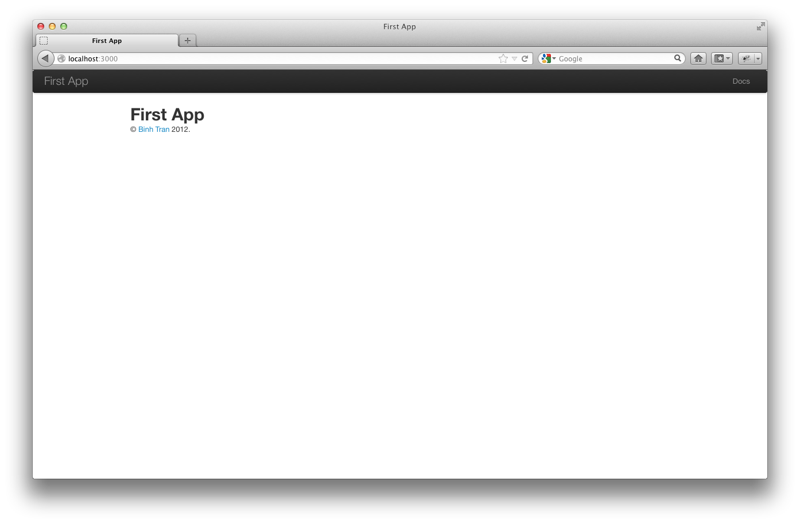

% Tower.js Tutorial
% Authors: Binh Tran

\clearpage

# From zero to deploy

## Introduction

This book is a recreation of the Rails Tutorial for the Node.js web framework Tower.js

Kudos to Michael Hartl in producing a bar-setting technology tutorial book. Much credit goes to Michael Hartl.

Tower.js is heavily influenced by Rails and adds it's own niceties.

Imagine finally writing web app code that is shorter because it bridges the client and the server.

Tower.js was started by Lance Pollard ([@viatropos](http://twitter.com/viatropos)) in 2012.

### Comments for various readers

The Tower.js Tutorial contains integrated tutorials for Tower.js and the CoffeeScript language, the JavaScript language, the Mocha testing framework, HTML, CSS, and a small amount of NoSQL.

**All readers:** A common question when learning Tower.js is whether to learn CoffeeScript and/or JavaScript first. The answer depends on your personal learning style and how much programming experience you already have. If you prefer to learn everything systematically from the ground up, or if you have never programmed before, then learning CoffeeScript and/or JavaScript first might work well for you. In the case of learning CoffeeScript, I recommend [The Little Book on CoffeeScript](http://arcturo.github.com/library/coffeescript/) by Alex MacCaw. In the case of learning JavaScript, I recommend [Eloquent JavaScript: A Modern Introduction to Programming](http://eloquentjavascript.net/) by Marijn Haverbeke and Object-Oriented JavaScript by Stoyan Stefanov. On the other hand, beginning Tower.js developers are excited about making web applications, and would rather not read through a 500 page book on CoffeeScript or JavaScript. In this case for CoffeeScript, I recommend the [CoffeeScript](http://www.codeschool.com/courses/coffeescript) course by Codeschool.

**Inexperienced programmers:** The Tower.js Tutorial is not targeted principally at beginning programmers. Web applications and even simple ones, are by their nature fairly complex. If you are completely new to web programming and find the Tower.js Tutorial too difficult, I suggest learning the basics of HTML and CSS then retry Tower.js Tutorial.

**Experienced programmers new to web development:** You probably understand ideas like classes, methods, data structures, etc., which is a big advantage. Be warned that if your background is in C/C++ or Java, you may find CoffeeScript and JavaScript a little odd. It might take some time to get used to it. Just keep at it and eventually you'll be fine. The Tower.js Tutorial covers all the web-specific ideas you'll need, so don't worry if you don't currently know a PUT from a POST.

**Experienced web developers new to Tower.js:** You have a great advantage especially since you have exposure to JavaScript. CoffeeScript should be easy to understand. Most of what we cover will likely be familiar, but test-driven development may be new to you, as may be the structured REST style favored by Tower.js. CoffeeScript has its own idiosyncrasies, so those will likely be new too.

**Experienced JavaScript and/or CoffeeScript programmers:** You'll blast through this book.

**Inexperienced Tower.js programmers:** Maybe you read some other tutorials and built some small Tower.js apps. You can still get a lot out of this book. Most important, the techniques here may be more up-to-date than when you originally learned Tower.js.

**Experienced Tower.js programmers:** This book is unnecessary for you, but you might be surprised at what you can still learn.

### Conventions in this book

The book conventions should mostly be self-explanatory. I'll mention some that may not be.

Both the HTML and PDF editions of this book are full of links, both to internal sections (such as Section 1.2) and to external sites (such as the main Tower.js download page).

Many examples in this book use command-line commands. To make things simple, all command line examples use a Unix-style command line prompt (a dollar sign), as follows:

````shell
$ echo "Have fun!"
Have fun!
````

Window users should know that their systems will use the analogous angle prompt >:

````shell
C:\Sites> echo "Have fun!"
Have fun!
````

On Unix systems, some commands shold be executed with **sudo**, which stands for "substitute user do". By default, a command executed with **sudo** is run as an administrative user, which has access to files and directories that normal users can't touch, such as in this example:

````shell
$ sudo node install.js
````

Most Unix/Linux/OS X systems require sudo by default, unless you are using **nvm** (Node Version Manager). In this case, you would type this instead:

````shell
$ node install.js
````

Tower.js comes with lots of commands that can be run at the command line. For example, we'll run a local development web server as follows:

````shell
$ tower server
````

As with command-line prompt, the Tower.js Tutorial uses the Unix convention for directory separators (i.e., a forward slash /). My Tower.js Tutorial sampleApp application, for example, lives in

````shell
/Users/btbinhtran/towerjs_projects/sampleApp
````

On Windows, the analogous directory would be

````shell
C:\Sites\sampleApp
````

The root directory for any given app is known as the Tower.js root, but this terminology is confusing and many people mistakenly believe that the "Tower.js root" is the root directory for Tower.js itself. For clarity, the Tower.js Tutorial will refer to the Tower.js root as the application root, and therefore all directories will be relative to this directory. For example, the **data** directory of my sample application is

````shell
/Users/btbinhtran/towerjs_projects/sampleApp/data
````

The application root directory here is everything before **data**, i.e.,

````shell
/Users/btbinhtran/towerjs_projects/sampleApp
````

For brevity, when referring to the file

````shell
/Users/btbinhtran/towerjs_projects/sampleApp/data/seeds.coffee
````

I'll omit the application root and write **data/seeds.coffee**.

The Tower.js Tutorial often shows output from various programs (shell commands, version control status, Node programs, etc.). Because of the innumerable small differences between different computer systems, the output you see may not always agree exactly with what is shown in the text, but don't be concerned.

Some commands may produce errors depending on your system. Instead of attempting the Sisyphean task of documenting all such errors is this tutorial, I will delegate to "Google the error message". "Googling" is good practice for real-life software development. If you have any problems while following the tutorial, please consult the resources listed on the Tower.js help page.

## Up and running

It's time to get going with a Tower.js development environment and our first application. There is quite a bit of overhead here, especially if you don't have much programming experience. Don't get discouraged if it takes a while to get started. It's not just you. Every developer goes through it (often more than once), but rest assured that the effort will be richly rewarded.

### Development environments

Considering various idiosyncratic customizations, there are probably as many development environments as there are Rails programmers, but there are at least two broad types: text editor/command line environments, and integrated development environments (IDEs). Let's consider the latter first.

#### IDEs

There is no shortage of Tower.js IDEs. Any IDE that supports Node.js and CoffeeScript will do. WebStorm is really good. If you're comfortable using an IDE, I suggest taking a look at the options mentioned to see what fits with the way you work.

#### Text editors and command lines

Instead of using an IDE, I prefer using a text editor to edit text and a command line to issue commands. Which combination you use depends on your tastes and your platform.

* **Text editor:** I recommend Sublime Text 2, an outstanding cross-platform text editor. Sublime Text is heavily influenced by TextMate, and in fact is compatible with most TextMate customizations, such as snippets and color schemes. TextMate, which is available only on OS X, is still a good choice if you use a Mac.) A second excellent choice is Vim, versions of which are available for all major platforms. Sublime Text can be obtained commercially, whereas Vim can be obtained at no cost. Sublime Text is much more accessible to beginners.
* **Terminal:** On OS X, I recommend using the native Terminal app or iTerm. On Linux, the default terminal is fine. On Windows, you can develop Tower.js applications in a virtual machine running Linux.

If you decide to use Sublime Text, you want to follow the setup instructions for [CoffeeScript Sublime Plugin](https://github.com/Xavura/CoffeeScript-Sublime-Plugin). *Note:* Such configuration settings are fiddly and error-prone, so this step should only be attempted by advanced users.

#### Browsers

Although there are many web browsers to choose from, it's common to use Firefox, Safari, or Chrome when developing. The screenshots in Tower.js Tutorial will be a Firefox browser. If you use Firefox, I suggest using the Firebug add-on, which lets you perform all sorts of magic, such as dynamically inspecting (and even editing) the HTML structure and CSS rules on any page. For those not using Firefox, both Safari and Chrome have a built-in "Inspect element" feature available by right-clicking on any part of the page.

#### A note about tools

In the process of getting your development environment up and running, you may find that you spend a lot of time getting everything just right. The learning process for editors and IDEs is particularly long. You can spend weeks on Sublime Text or Vim tutorials alone. If you're new to this game, I want to assure you that spending time learning tools is normal. Everyone goes through it. Sometimes it's frustrating and it's easy to get impatient when you have an awesome web app in your head and you just want to learn Tower.js already, but have to spend a week learning some weird ancient Unix editor just to get started. However, a craftsman has to know his tools and in the end, the reward is worth the effort.

### Node.js and Node Package Manager (NPM), CoffeeScript, and Git

It's time to install Tower.js. I've tried my best to cover as many bases as possible. Many things can go wrong during these steps. Please Google the error message or consult the Tower.js Tutorial help page if you run into trouble.

**Unless otherwise noted, you should use the exact versions of all software used in the tutorial, including Tower.js itself, if you want the same results.** Sometimes minor version differences will yield identical results, but you shouldn't count on this, especially with respect to Tower.js and Node.js versions.

#### Tower.js Installer (Windows)

  TODO

#### Install Git

Much of the Node.js ecosystem depends in one way or another on a version control system called Git. Because its use is ubiquitous, you should install Git even at this early stage. I suggest following the installation instructions for your platform at the Installing Git section of Pro Git.

#### Install Node.js

The next step is to install Node.js and Node Package Manager (NPM). At this time, Node.js is bundled with NPM. Maybe your system already has Node.js and NPM. Try running

````shell
$ node -v
v0.8.16
````

and

````shell
$ npm -v
1.1.69
````

to see the Node.js and NPM version numbers. 


At the time of writing Tower.js 0.4.2-22, Tower.js works fine with Node.js version 0.8.16 and NPM version 1.1.69.

As part of installing Node.js and NPM, if you are using OS X or Linux I strongly recommend using [Node Version Manager (NVM)](https://github.com/creationix/nvm), which allows you to install and manage multiple versions of Node.js, which is invaluable because Node.js updates a lot. I recommend doing the Manual install for NVM like so

````shell
$ git clone git://github.com/creationix/nvm.git ~/nvm
````

Activate NVM by running:

````shell
$ . ~/nvm/nvm.sh
````

I recommend putting the previous command in file .profile or .bash_profile so you don't have to reactivate NVM everytime you restart your command line.

You can do that by running:

````shell
$ echo ". ~/nvm/nvm.sh" >> ~/.profile
````

or for .bash_profile:

````shell
$ echo ". ~/nvm/nvm.sh" >> ~/.bash_profile
````

These 2 files, .profile and .bash_profile, setup configurations for your command line.

After installing NVM, you can install Node.js and NPM as follows:
````shell
$ nvm install 0.8.16
<wait a bit>
````

The command installs the 0.8.16 version of Node.js. Depending on your system, it could take a while to download and compile, so don't worry if it seems to be taking forever.

(Like I said, lots of things can go wrong. The only solution is web searches and determination.)

After installing Node.js, you should configure your system for the other software needed to run Tower.js applications. This typically involves installing Node.js *libraries*, also known as **packages**, which are self-contained packages of Node.js code.

It's good to specify which version of Node.js you want to use by running:

````shell
$ nvm use 0.8.16
````

Also, it's good to specify which version of Node.js is activated when you restart your command line by running:

````shell
$ nvm alias default 0.8.16
````

So everytime you restart your computer or your command line, you'll be using Node.js version 0.8.16.

If you ever get stuck with NVM, run:

````shell
$ nvm help
````

#### Install Tower.js

Once you've installed Node.js, installing Tower.js should be easy through NPM. This tutorial works on Tower 0.4.2-22, which we can install as follows:

````shell
$ npm install -g tower@0.4.2-22
````

We also need to install CoffeeScript version 1.4.0 like so:

````shell
$ npm install -g coffee-script@1.4.0
````

and install Grunt version 0.3.17:

````shell
npm install -g grunt@0.3.17
````

To check your Tower.js installation, run the following command to print out the version number:

````shell
$ tower -V
0.4.2-22
````

### The first application

Almost all Tower.js applications start the same way, with the **tower** command. This nifty program creates a skeleton Tower.js application in a directory of your choice. To get started, make a directory for your Tower.js projects and then run the **tower** command to make the first application.

````shell
$ mkdir towerjsProjects
$ cd towerjsProjects
$ tower new firstApp
   create : firstApp/.gitignore
   create : firstApp/.npmignore
   create : firstApp/.slugignore
   create : firstApp/Cakefile
   create : firstApp/app/config/client/bootstrap.coffee
   create : firstApp/app/config/client/watch.coffee
   create : firstApp/app/config/server/assets.coffee
   create : firstApp/app/config/server/bootstrap.coffee
   create : firstApp/app/config/server/credentials.coffee
   create : firstApp/app/config/server/databases.coffee
   create : firstApp/app/config/server/session.coffee
   create : firstApp/app/config/server/environments/development.coffee
   create : firstApp/app/config/server/environments/production.coffee
   create : firstApp/app/config/server/environments/test.coffee
   create : firstApp/app/config/server/initializers
   create : firstApp/app/config/shared/application.coffee
   create : firstApp/app/config/shared/locales/en.coffee
   create : firstApp/app/config/shared/routes.coffee
   create : firstApp/app/controllers/client/applicationController.coffee
   create : firstApp/app/controllers/server/applicationController.coffee
   create : firstApp/app/models/client
   create : firstApp/app/models/server
   create : firstApp/app/models/shared
   create : firstApp/app/stylesheets/client/application.styl
   create : firstApp/app/stylesheets/server/email.styl
   create : firstApp/app/templates/server/layout/application.coffee
   create : firstApp/app/templates/server/layout/_meta.coffee
   create : firstApp/app/templates/shared/welcome.coffee
   create : firstApp/app/templates/shared/layout/_body.coffee
   create : firstApp/app/templates/shared/layout/_flash.coffee
   create : firstApp/app/templates/shared/layout/_footer.coffee
   create : firstApp/app/templates/shared/layout/_header.coffee
   create : firstApp/app/templates/shared/layout/_navigation.coffee
   create : firstApp/app/templates/shared/layout/_sidebar.coffee
   create : firstApp/app/views/client/layout/application.coffee
   create : firstApp/data/seeds.coffee
   create : firstApp/lib
   create : firstApp/log
   create : firstApp/package.json
   create : firstApp/Procfile
   create : firstApp/public/404.html
   create : firstApp/public/500.html
   create : firstApp/public/favicon.png
   create : firstApp/public/crossdomain.xml
   create : firstApp/public/humans.txt
   create : firstApp/public/robots.txt
   create : firstApp/public/fonts
   create : firstApp/public/images
   create : firstApp/public/javascripts
   create : firstApp/public/stylesheets
   create : firstApp/public/swfs
   create : firstApp/public/uploads
   create : firstApp/README.md
   create : firstApp/scripts/tower
   create : firstApp/server.js
   create : firstApp/test/cases/controllers/client
   create : firstApp/test/cases/controllers/server
   create : firstApp/test/cases/features/client
   create : firstApp/test/cases/features/server
   create : firstApp/test/cases/models/client
   create : firstApp/test/cases/models/server
   create : firstApp/test/cases/models/shared
   create : firstApp/test/factories
   create : firstApp/test/client.coffee
   create : firstApp/test/mocha.opts
   create : firstApp/test/server.coffee
   create : firstApp/tmp
   create : firstApp/vendor/javascripts
   create : firstApp/vendor/stylesheets
   create : firstApp/grunt.coffee
   create : firstApp/wiki/home.md
   create : firstApp/wiki/_sidebar.md
````

Notice how many files and directories the **tower** command creates. This standard directory and file structure is one of the many advantages of Tower.js. It immediately gets you from zero to a functional (if minimal) application. Also, since the structure is common to all Tower.js apps, you can immediately get your bearings when looking at someone else's code. A summary of the default Tower.js files appears in Table 1.1. We'll learn about most of these files and directories throughout the rest of this book.

#### Todo: File/Directory Purpose Table

### NPM

After creating a new Tower.js application, the next step is to use NPM to install and include the Node.js packages needed by the app. We're going to update the packages and run NPM again. This involves opening the **package.json** file with your favorite text editor:

````shell
$ cd firstApp/
$ subl package.json
````

The result should look like Listing 1.4. The code in this file is JavaScript, but don't worry about the syntax at this point. Chapter 4 will cover JavaScript and CoffeeScript in more depth.

Listing 1.4. The default **package.json** file in the firstApp directory.

````javascript
{
  "name": "firstApp",
  "private": true,
  "version": "0.1.0",
  "description": "",
  "homepage": "http://User.github.com/firstApp",
  "main": "./server.js",
  "subdomain": "firstApp",
  "author": "'Binh Tran' <btbinhtran@gmail.com>",
  "keywords": [
    "node"
  ],
  "maintainers": [{
    "name": "Binh Tran",
    "email": "btbinhtran@gmail.com"
  }],
  "contributors": [

  ],
  "licenses": [
    {
      "type": "MIT",
      "url": "http://mths.be/mit"
    }
  ],
  "bugs": {
    "url": "https://github.com/User/firstApp/issues"
  },
  "repository": {
    "type": "git",
    "url": "https://github.com/User/firstApp.git"
  },
  "engines": {
    "node": ">= 0.6.0",
    "npm": ">= 1"
  },
  "dependencies": {
    "async": ">= 0.1.22",
    "coffee-script": "1.3.3",
    "mongodb": ">= 1.1.10",
    "coffeecup": ">= 0.3.17",
    "socket.io": ">= 0.8.7",
    "socket.io-client": ">= 0.9.5",
    "tower": ">= 0.4.2",
    "which": ">= 1.0.5"
  },
  "optionalDependencies": {
    "nodemailer": ">= 0.3.28",
    "kue": ">= 0.3.4"
  },
  "devDependencies": {
    "chokidar": "~0.4.0",
    "stylus": ">= 0.29.0",
    "Faker": ">= 0.1.3",
    "less": ">= 1.2.2",
    "uglify-js": ">= 1.1.1",
    "mocha": ">= 0.12.1",
    "chai": ">= 0.3.3",
    "sinon": ">= 1.3.1",
    "knox": ">= 0.0.11",
    "gzip": ">= 0.1.0",
    "cli-table": ">= 0.0.1",
    "grunt-contrib-less": ">= 0.3.0",
    "grunt-contrib-stylus": ">= 0.3.0",
    "grunt-contrib": ">= 0.2.0",
    "superagent": ">= 0.9.5",
    "wrench": ">= 1.3.8",
    "fibers": "~0.6.8",
    "ejs": ">= 0.6.1"
  },
  "scripts": {
    "test": "./node_modules/mocha/bin/mocha $(find test -name \"*Test.coffee\")",
    "prepublish": "npm prune; rm -rf node_modules/*/{test,example,bench}*",
    "start": "node server.js -e production"
  },
  "tower": {
    "stylesheets": "styl",
    "scripts": "coffee",
    "templates": "coffee"
  }
}
````

Right now, just focus on the depencies within **package.json** which are:

````javascript
{

...

  "dependencies": {
    "async": ">= 0.1.22",
    "coffee-script": "1.3.3",
    "mongodb": ">= 1.1.10",
    "coffeecup": ">= 0.3.17",
    "socket.io": ">= 0.8.7",
    "socket.io-client": ">= 0.9.5",
    "tower": ">= 0.4.2",
    "which": ">= 1.0.5"
  },
  "optionalDependencies": {
    "nodemailer": ">= 0.3.28",
    "kue": ">= 0.3.4"
  },
  "devDependencies": {
    "chokidar": "~0.4.0",
    "stylus": ">= 0.29.0",
    "Faker": ">= 0.1.3",
    "less": ">= 1.2.2",
    "uglify-js": ">= 1.1.1",
    "mocha": ">= 0.12.1",
    "chai": ">= 0.3.3",
    "sinon": ">= 1.3.1",
    "knox": ">= 0.0.11",
    "gzip": ">= 0.1.0",
    "cli-table": ">= 0.0.1",
    "grunt-contrib-less": ">= 0.3.0",
    "grunt-contrib-stylus": ">= 0.3.0",
    "grunt-contrib": ">= 0.2.0",
    "superagent": ">= 0.9.5",
    "wrench": ">= 1.3.8",
    "fibers": "~0.6.8",
    "ejs": ">= 0.6.1"
  },

...

}
````

These lines state what Node.js packages are used for your Tower.js application.

The lines

````javascript
{

...
  
  "dependencies": {
    "async": ">= 0.1.22",
    "coffee-script": "1.3.3",
    "mongodb": ">= 1.1.10",
    "coffeecup": ">= 0.3.17",
    "socket.io": ">= 0.8.7",
    "socket.io-client": ">= 0.9.5",
    "tower": ">= 0.4.2",
    "which": ">= 1.0.5"
  },

  ...

}
````

state the Node.js packages that are at the core of your Tower.js application. Your app is "dependent" on those packages.

The lines

````javascript
{

...

  "optionalDependencies": {
    "nodemailer": ">= 0.3.28",
    "kue": ">= 0.3.4"
  },

...

}
````

are what you probably guessed, "optional" Node.js packages for your application.

The lines

````javascript
{

...

  "devDependencies": {
    "chokidar": "~0.4.0",
    "stylus": ">= 0.29.0",
    "Faker": ">= 0.1.3",
    "less": ">= 1.2.2",
    "uglify-js": ">= 1.1.1",
    "mocha": ">= 0.12.1",
    "chai": ">= 0.3.3",
    "sinon": ">= 1.3.1",
    "knox": ">= 0.0.11",
    "gzip": ">= 0.1.0",
    "cli-table": ">= 0.0.1",
    "grunt-contrib-less": ">= 0.3.0",
    "grunt-contrib-stylus": ">= 0.3.0",
    "grunt-contrib": ">= 0.2.0",
    "superagent": ">= 0.9.5",
    "wrench": ">= 1.3.8",
    "fibers": "~0.6.8",
    "ejs": ">= 0.6.1"
  },

...

}
````

are Node.js packages that are needed when you are **dev**eloping your application.

We'll discuss what the other lines in **package.json** are later.

#### TODO Node.js package version numbers

### Node.js package version numbers


Right now, we need to change the **package.json** to use the specific major and minor version numbers of Node.js packages.

If you don't specify a version number on the package, NPM will install the latest version of the package. Unfortunately, package updates cause minor but potentially confusing breakage in minor and major updates. That is why you apply a range on a specific version number.

Change **firstApp/package.json** with latest package version ranges, node and npm versions:

````javascript
{
  "name": "firstApp",
  "private": true,
  "version": "0.1.0",
  "description": "",
  "homepage": "http://User.github.com/firstApp",
  "main": "./server.js",
  "subdomain": "firstApp",
  "author": "'Binh Tran' <btbinhtran@gmail.com>",
  "keywords": [
    "node"
  ],
  "maintainers": [{
    "name": "Binh Tran",
    "email": "btbinhtran@gmail.com"
  }],
  "contributors": [

  ],
  "licenses": [
    {
      "type": "MIT",
      "url": "http://mths.be/mit"
    }
  ],
  "bugs": {
    "url": "https://github.com/User/firstApp/issues"
  },
  "repository": {
    "type": "git",
    "url": "https://github.com/User/firstApp.git"
  },
  "engines": {
    "node": "~0.8.16",
    "npm": "~1.1.69"
  },
  "dependencies": {
    "async": "~0.1.22",
    "coffee-script": "~1.4.0",
    "mongodb": "~1.2.6",
    "coffeecup": "~0.3.18",
    "socket.io": "~0.9.13",
    "socket.io-client": "~0.9.11",
    "tower": "~0.4.2",
    "which": "~1.0.5"
  },
  "optionalDependencies": {
    "nodemailer": "~0.3.37",
    "kue": "~0.5.0"
  },
  "devDependencies": {
    "chokidar": "~0.5.0",
    "stylus": "~0.31.0",
    "Faker": "~0.1.3",
    "less": "~1.3.3",
    "uglify-js": "~2.2.2",
    "mocha": "~1.7.4",
    "chai": "~1.4.2",
    "sinon": "~1.5.2",
    "knox": "~0.4.6",
    "gzip": "~0.1.0",
    "cli-table": "~0.2.0",
    "grunt-contrib-less": "~0.3.2",
    "grunt-contrib-stylus": "~0.3.1",
    "grunt-contrib": "~0.3.0",
    "superagent": "~0.10.0",
    "wrench": "~1.4.4",
    "fibers": "~0.6.8",
    "ejs": "~0.8.3"
  },
  "scripts": {
    "test": "./node_modules/mocha/bin/mocha $(find test -name \"*Test.coffee\")",
    "prepublish": "npm prune; rm -rf node_modules/*/{test,example,bench}*",
    "start": "node server.js -e production"
  },
  "tower": {
    "stylesheets": "styl",
    "scripts": "coffee",
    "templates": "coffee"
  }
}
````

The syntax

````javascript
"tower": ">= 0.4.2"
````

installs the latest version of the tower package as long as it's greater than version 0.4.2 even if it's **3.3**. Meanwhile, the code

````javascript
"socket.io": "~0.9.13"
````

installs the package **coffee-script** as long as it's lower than version **0.10**. In other words, the >= notation always does upgrades, whereas the ~0.9.13 notation only performs upgrades to patch releases (e.g. from **0.9.13** to **0.9.14**), but not to minor releases (e.g. from **0.9** to **0.10**). Unfortunately, package updates cause minor but potentially confusing breakage in minor and major updates. That is why we will apply a range on a package version numbers, which is good practice.

Once you've created the proper **package.json** file, install the packages using **npm install**

````shell
$ npm install
npm http GET https://registry.npmjs.org/async
...
````

The **npm install** command might take some time, but when it's done our application will be ready to run.

### tower server

Thanks to running **tower new** and **npm install**, we already have an application we can run. It's because Tower.js comes with a command-line program, or script, that runs a local web server, visible only from your development machine.

First run

````shell
$ cake watch
Default database not set, using Memory store
Running "copy:stylesheets" (copy) task
Copied 2 files.

Running "copy:javascripts" (copy) task
Copied 35 files.

Running "copy:images" (copy) task
Copied 0 files.

Running "coffee:compile" (coffee) task

Running "less:bootstrap" (less) task
File public/stylesheets/vendor/stylesheets/bootstrap/bootstrap.css created.

Running "stylus:compile" (stylus) task
File public/stylesheets/app/stylesheets/client/application.css created.

Running "templates:compile" (templates) task

Running "watch" task
Waiting...
````

to compile your CoffeeScript files and watch for any file text changes. If you edit any of your CoffeeScript files, they will automatically recompiled.

Then run the development server:

````shell
$ tower server
firstApp: tower server
   info  - socket.io started
Tower development server listening on port 3000
````

This tells us that the application is running on port number 3000. The application is running on port number 3000 at the address 0.0.0.0. This address tells the computer to listen on every available IP address configured on that specific machine. In particular, we can view the application using the special address **127.0.0.1**, which is also known as **localhost**. We can see the result of visiting http://localhost:3000/



\clearpage

# A demo app

## Planning the application

In this section, we'll outline our plans for the demo application. As in Section 1.2.3, we'll start by generating the application skeleton using the tower command:

### Modeling demo users

## The Users resource

In this section, we'll implement the users data model in Section 2.1.1, along with a web interface to that model. The combination will constitute a Users resource, which will allow us to think of users as objects that can be created, read, updated, and deleted through the web via the HTTP protocol. As promised in the introduction, our Users resource will be created by a scaffold generator program, which comes standard with each Tower.js project. I urge you not to look too closely at the generated code at this time. It will only add confusion.

Tower.js scaffolding is generated by passing the scaffold command to the tower generate script. The argument of the scaffold command is the singular version of the resource name (in this case, User), together with optional parameters for the data model's attributes:

\clearpage

# Third chapter

\clearpage
